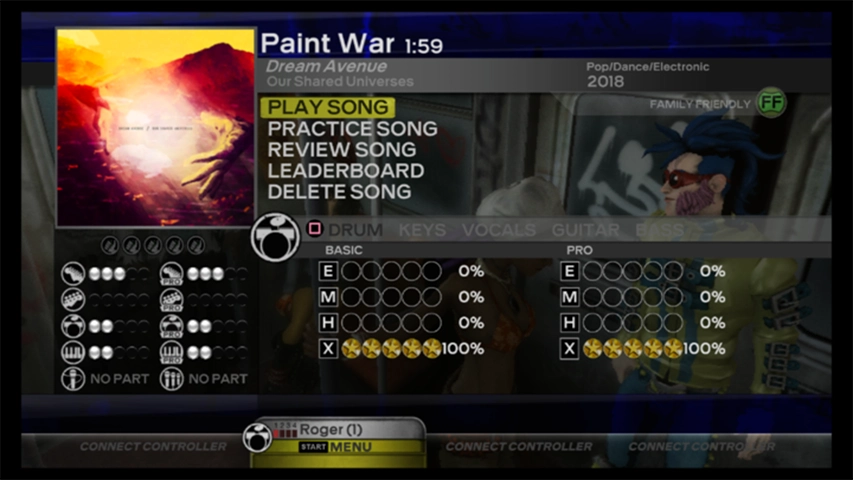

<h1>Ruggy Customs</h1>

 

# 💠 Table of Contents
- [About](#about)
- [Songs](SONGS.md)

## About
I'm active on the Rock Band's custom songs community since 2017, and I've created more than 30 songs for the game, with full band charts ready to be played on all available systems! Here, I'm saving all my REAPER and MAGMA projects for every song I've charted for the game. The DLC files can be found on C3 (the Customs Creators Collective).

## Songs

### "Paint War", by *Dream Avenue* `v5`

    

My first custom was a song of my own chiptune project *Dream Avenue*, I had released Paint War song BEFORE I officialy released the *Our Shared Universes EP*.
- Original release date: `August 23, 2017`.

#### Versions
- `v1` `August 23, 2017`: Initial release.
- `v2` `August 24, 2017`: Added `PRO Guitar/Bass` parts, minor fixes.
- `v3` `June 13, 2018`: Minor fixes, updated metadata.
- `v4` `December 15, 2018`: Changed some sessions on `PRO Keys`.
- `v5` `December 19, 2019`: **REMASTERED** Final version.