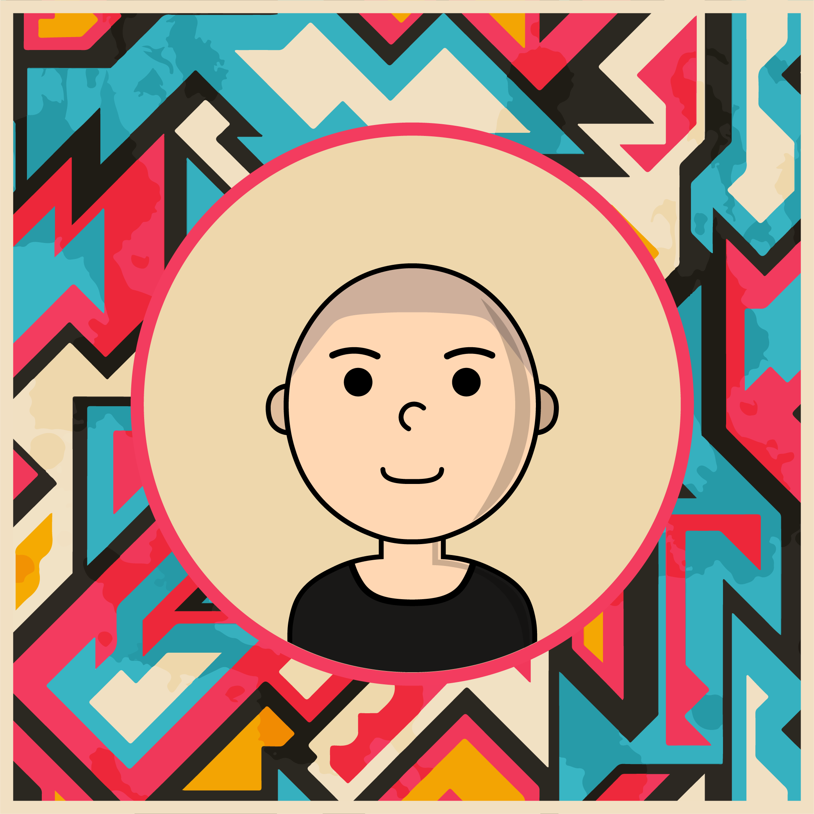

<h1>Ruggy Customs</h1>

 

<a href="https://drive.google.com/file/d/1HRhEPJwDfihpIArJyK4nvU6YE0I4Nqvx/view?usp=sharing" target="_blank" style="font-size: 36px;">XBox 360 (CON File)</a>
<a href="https://drive.google.com/file/d/16Z1sVQflXeZBgTA9c3wm448asOTg-JQg/view?usp=sharing" target="_blank" style="font-size: 36px;margin-left: 4rem;">PS3 (PKG File)</a>

