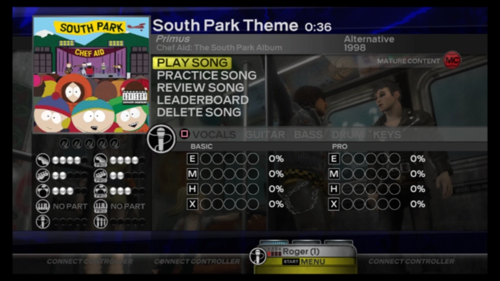
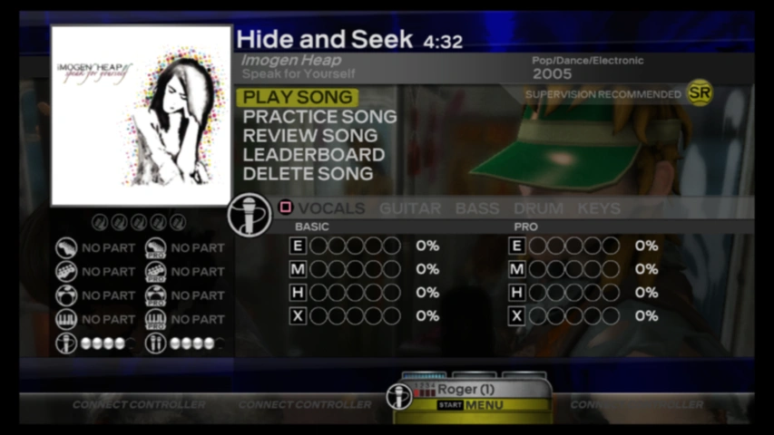
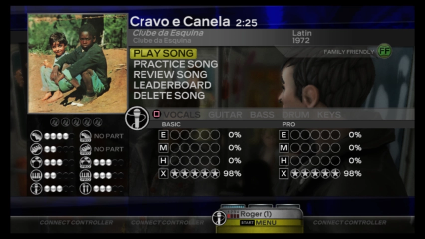
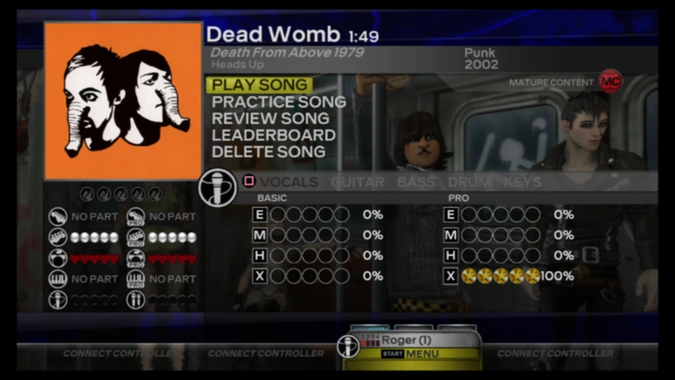

### Paint War, by *Dream Avenue*
My first custom was a song of my own chiptune project *Dream Avenue*, I had released Paint War song BEFORE I officialy released the *Our Shared Universes EP* on Bandcamp.

*Released: August 23, 2017.*

    

### South Park Theme, by *Primus*
The intro song from the TV series *South Park*, performed by alternative rock band *Primus*.

*Released: September 1, 2017.*

    

### Hide and Seek, by *Imogen Heap*
The first single from *Imogen Heap*'s second album *Speak for Yourself*. **Hide and Seek** first gained popularity after appearing in a scene in the final episode of the second season of the Fox television series *The O.C.* and in *The Shooting*, a *Saturday Night Live* parody of the scene.

*Released: September 4, 2017.*

    

### Cravo e Canela, by *Clube da Esquina*
The sixth track from *Clube da Esquina*'s ephomynous debut album. The LP, credited to *Milton Nascimento* and *Lô Borges*, was considered in the list of the Brazilian version of *Rolling Stone* as the **7th best Brazilian album of all time**. In professional reviews, Clube da Esquina follows as one of the most marking albums in *Milton Nascimento*'s and *Lô Borges*' career, as well to *Brazilian Popular Music* (known there as **MPB**).

*Released: September 17, 2017.*

    

### Dead Womb, by *Death from Above 1979*
The first track from punk duo *Death from Above 1979*'s first studio release *Heads Up*. The electronic voice intro was also sampled on *Crystal Castles*' song *Untrust Us*.

*Released: September 20, 2017.*

    

